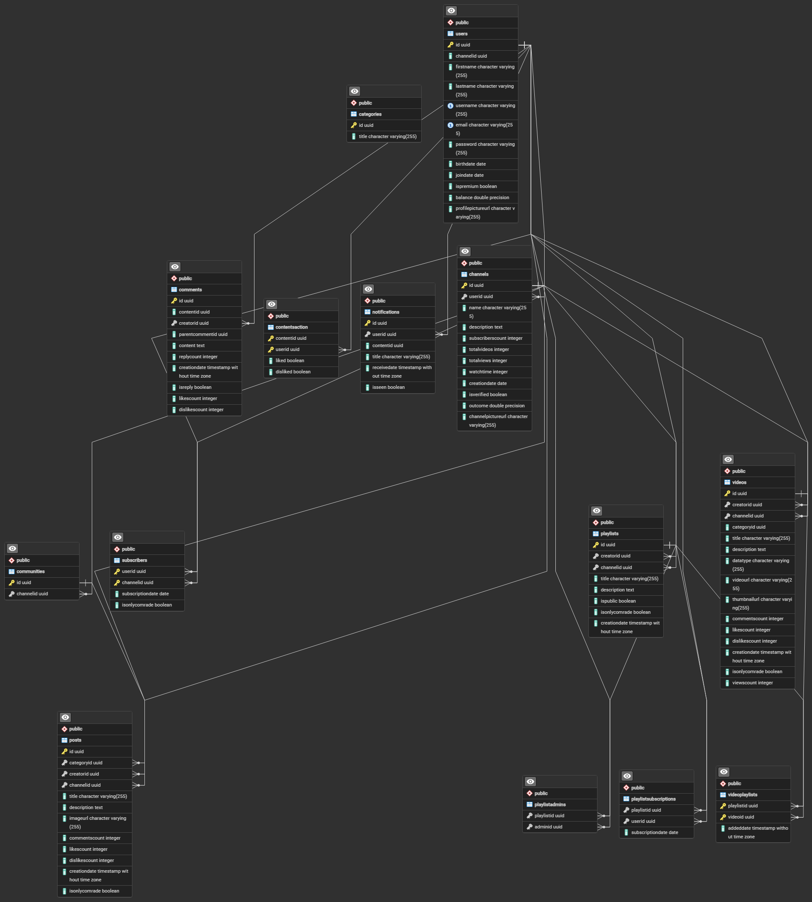

# ☆ WETUBE ☆
## In the name of the Motherland and the relentless pursuit of order
 we present to you WeTube. This platform, forged from the fires of our collective ambition, represents the pinnacle of our efforts to create a unified, controlled, and disciplined environment for video sharing.

My comrade theDanialTP and I, have devoted countless hours and resources to the development of this project. Our work, done in the spirit of unity and strength, employs the finest in technological prowess, utilizing Java.

Over the course of many sleepless nights and tireless days, we have overcome innumerable obstacles, always pushing forward with the determination befitting our cause.
Ladies and Gentlemen and nonbinaries, here I represent to you, WeTube:

### Attention
Comrades and fellow citizens,
Today, we stand together in the digital realm to unveil a platform that serves as a testament to our commitment to freedom, creativity, and the unyielding pursuit of truth. I present to you WeTube, a video-sharing application that not only embodies the pinnacle of technological innovation but also serves as a powerful statement against the dark chapters of human history—those of fascism and communism.

We have chosen to adorn our platform with the symbols of these oppressive regimes, not to glorify them, but to highlight the tyranny and destruction they brought upon the world. These symbols stand as stark reminders of the iron-fisted control and the suppression of individual freedoms that characterized both fascist and communist ideologies. Through our application, we aim to reclaim these symbols, transforming them into icons of resistance and beacons of hope for a future free from dictatorship and oppression.

#### WeTube: A Platform of Liberation
WeTube is not merely a video-sharing application; it is a digital sanctuary where freedom of expression and creativity flourish. In stark contrast to the controlled and censored environments imposed by fascist and communist regimes, WeTube empowers individuals to share their voices, ideas, and artistic expressions without fear of retribution or censorship.

Our platform offers a range of features that encourage open dialogue and creative freedom. Users can create and share videos, engage in thoughtful discussions, and build communities around shared interests. We believe that through the free exchange of ideas and the celebration of diversity, we can forge a society that values every individual's contribution and promotes mutual understanding and respect.

#### The Special "Only Comrade" Feature

One of the unique features of WeTube is the "Only Comrade" option, which allows users to offer exclusive content to specific audiences for a fee. This feature serves as a metaphor for the importance of valuing and supporting individual creators, something that fascist and communist regimes actively suppressed. By enabling users to monetize their content, we emphasize the importance of personal agency and the right to reap the rewards of one's labor—a fundamental principle that stands in direct opposition to the collectivist and authoritarian ideologies of the past.

#### A Statement Against Dictatorship

In utilizing the symbols of fascism and communism, we make a bold statement against the dictatorships that these regimes represented. Fascism, with its brutal nationalism and militaristic oppression, sought to control every aspect of life, silencing dissent and crushing individual freedoms. Communism, in its pursuit of a classless society, similarly imposed severe restrictions on personal liberty, often resorting to violence and repression to maintain control.

Both ideologies left deep scars on the fabric of humanity, resulting in immense suffering, loss of life, and the stifling of human potential. WeTube stands as a repudiation of these regimes. Our platform is built on the principles of openness, inclusivity, and the unwavering belief in the power of the individual. We honor the memory of those who suffered under these oppressive systems by creating a space where their stories can be told, their voices heard, and their experiences shared.

#### Celebrating Freedom and Creativity

At its core, WeTube is a celebration of freedom and creativity. We have designed this platform to be a haven for those who dare to dream, innovate, and express themselves without fear. It is a place where the spirit of human ingenuity can thrive, unencumbered by the chains of authoritarian control.

Through WeTube, we envision a world where every individual has the opportunity to share their unique perspective and contribute to the collective tapestry of human knowledge and culture. By fostering a community that values diversity and encourages open dialogue, we aim to create a digital society that mirrors the ideals of a free and just world.

#### Did not have the intension to give you a long speech! so,
In conclusion, WeTube is more than just an application; it is a movement. It is a powerful response to the tyranny of fascism and communism, a testament to the resilience of the human spirit, and a beacon of hope for a future where freedom, creativity, and individuality are celebrated. Let us stand together in solidarity, reclaiming the symbols of oppression and transforming them into icons of resistance and empowerment. Through WeTube, we honor the past, confront the present, and build a future where every voice can be heard and every individual can thrive.

Thank you, and may we continue to strive for a world free from tyranny and rich with the boundless potential of human creativity.

### Introduction
RedWaveTube is a Java-based application inspired by YouTube, designed for your Advanced Programming course final project. This project aims to provide users with the ability to upload, view, and share videos, replicating the core functionalities of YouTube. Users can create personalized accounts, subscribe to channels, and engage in discussions through comments. The project is an opportunity to apply advanced programming skills, gain hands-on experience with Java and Git, and develop a complex software system.

WeTube is a video sharing application born from the ideology of absolute control and order, reflecting the iron will of the USSR and the unyielding discipline of the past. It stands as a testament to our commitment to creating a platform where content is curated, controlled, and disseminated with precision.

The application offers a range of features for our comrades, including video playback, playlist creation, search functionality, content creator access, adding playlists, and playing videos from playlists, and many more! Personalized video recommendations ensure that users stay informed and engaged with content that aligns with our unified vision.

### Features
- User Accounts: Secure account creation, login, and management.
- Channels: Public channels for users to post videos and act as profile pages.
- Subscriptions: Subscribe to other channels and view a list of subscribed channels.
- Only Comrade Subscriptions: View the special content of each channel.
- Home Page: Display trending video thumbnails and provide navigation options.
- Playlists: Create custom playlists, including default "Watch Later" and "Liked Videos" playlists and "Watch History".
- Video Page: View video details, comments, and related information.
- Video Player: Play, pause, control volume and speed, and use a progress bar.
- Video Analytics: Track views, likes, dislikes, comments, and display publishing dates.
- Creator Dashboard: Upload, delete, and manage videos.
- Search: Find channels and videos by title.
- Video Categories: Tag videos with specific categories.
- Dynamic Home Page: Personalized recommendations based on user activity.
- Watch History: View a list of recently watched videos.
- Dark & Light Theme: Switch between light and dark modes.
- Public Playlists: Create and share public playlists, including collaborative ones.
- Notifications: Receive updates on new videos from subscribed channels.
- YouTube Music: Integrate a music streaming service.
- Recommendation System: Suggest relevant videos and channels using machine learning.
- YouTube Premium: Offer a subscription-based service with additional benefits.
- Community Features: Create posts, polls, and interactive content.
- Custom Thumbnails: Control video presentation with customizable thumbnails.

## Technology Stack

- **Programming Language**: Java
- **Database**: PostgreSQL (or any SQL-based/NoSQL database)
- **GUI Library**: JavaFX
- **Networking**: Socket Programming
- **Multithreading**: Java Multithreading

## UML and Design Patterns

### Design Patterns Used

- **Singleton**: Ensuring a single instance of the server.
- **Factory**: Creating various request and response types.
- **Observer**: Managing user subscriptions and notifications.
- **DAO (Data Access Object)**: Interacting with the database.

### ERD Diagram

## Contributions

- **Team Members**: [List of team members and their contributions]
- **Mentor**: [Mentor's name and contributions]

## Usage

### Setup Instructions

1. Clone the repository: `git clone https://github.com/your-repo-url`
3. Set up the database: Import the schema from `database/schema.sql`
4. Run the server: `java -jar server.jar`
5. Run the client: `java -jar client.jar`

### Conclusion
WeTube stands as a testament to our unwavering commitment to control, order, and unity. It is a powerful and versatile platform that offers a rich and engaging video-sharing experience. We invite you to join us in this endeavor, to embrace the spirit of the Motherland, and to contribute to a unified and disciplined digital landscape.

